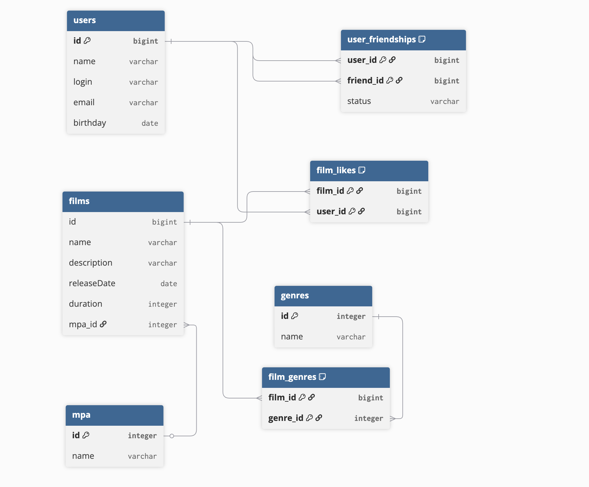

# java-filmorate

### Entity Relationship Diagram


### Основные SQL запросы
#### 1. Получить список всех пользователей:
```sql
SELECT *
FROM users;
```

#### 2. Получить пользователя по его id:
```sql
SELECT *
FROM users
WHERE id = {id};
```

#### 3. Получить список друзей пользователя
```sql
SELECT u.id,
       u.name
FROM users AS u
INNER JOIN user_friendships AS uf ON u.id = uf.friend_id
WHERE uf.user_id = {id} AND uf.status = 'confirmed';
```

#### 4. Получить список всех фильмов:
```sql
SELECT *
FROM films;
```

#### 5. Получить фильм по его id:
```sql
SELECT *
FROM films
WHERE id = {id};
```
#### 6. Получение списка самых популярных фильмов по кол-ву лайков
```sql
SELECT f.id,
       f.name,
       COUNT(fl.user_id) AS likes_count
FROM films AS f
LEFT JOIN film_likes AS fl ON f.id = fl.film_id
GROUP BY f.id, f.name
ORDER BY likes_count DESC
LIMIT {limit};
```
